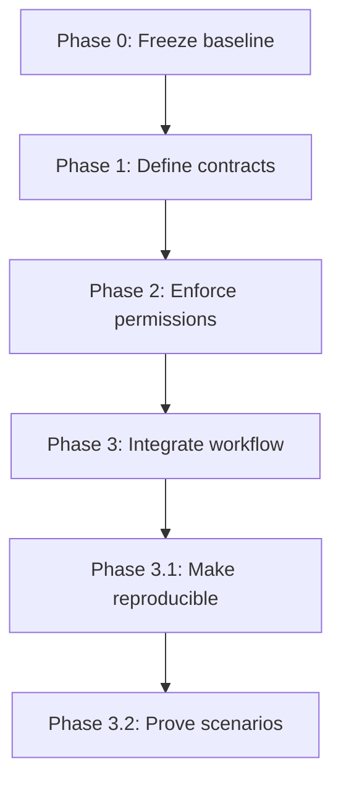

# MVP_1 Phase Understanding Guide

This directory explains the development of the governed ISO/IEC 42001 Clause
04 assessment MVP one phase at a time.

The documents are written as reader guides. Historical implementation records
remain in `docs/baseline/` and `docs/implementation/`, while architectural
decisions remain in `docs/architecture/`.

## Phase map

| Phase | Main question | Principal result |
|---|---|---|
| [Phase 0](phase_0_overview.md) | What must remain unchanged? | Frozen deterministic Clause 04 baseline |
| [Phase 1](phase_1_contracts.md) | What structured information may components exchange? | Schema-bound assessment contracts |
| [Phase 2](phase_2_governance.md) | What is each component permitted to do? | Deterministic, fail-closed governance layer |
| [Phase 3](phase_3_workflow.md) | Can the governed components complete an assessment? | End-to-end sequential workflow |
| [Phase 3.1](phase_3_1_reproducibility.md) | Can someone else install and validate it? | Reproducible package and CI |
| [Phase 3.2](phase_3_2_portfolio_scenarios.md) | Does it behave correctly outside the successful case? | Complete, incomplete, and reviewed scenarios |

## How the phases build on each other

The phases are cumulative. A later phase adds evidence about the system without
removing the controls established by an earlier phase.

## Overall boundary

The MVP:

- covers ISO/IEC 42001 Clause 04 only;
- supports audit readiness and professional portfolio demonstration;
- keeps the original deterministic readiness score authoritative;
- requires explicit external input for human dispositions;
- uses no LLM or external model in the governed acceptance path;
- does not provide certification or accredited conformity assessment.

## Recommended reading order

Read the phase guides in sequence. For a short portfolio walkthrough, focus on
Phase 0, Phase 2, Phase 3, and Phase 3.2: these explain the trusted baseline,
governance controls, complete workflow, and visible demonstration cases.
