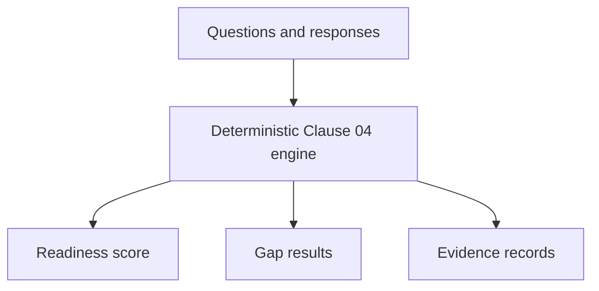

# Phase 0 — Freeze and Understand the Baseline

## Objective

Establish an immutable reference point before adding an agentic assessment
layer. Phase 0 answers:

> What already works, and what must later phases avoid duplicating or silently
> changing?

## Starting position

The existing `clause_04_context` package already provided:

- Clause 04 questions and human responses;
- input and alignment validation;
- rule-based response scoring;
- evidence-reference extraction;
- structural and evidence-gap detection;
- readiness-score calculation;
- Markdown report and JSON evidence-record generation.

It was therefore treated as the existing assessment engine, not as disposable
prototype code.

## What Phase 0 added

Phase 0 did not add new assessment decisions. It recorded and protected the
baseline by:

1. Mapping package imports and execution paths.
2. Running the original test suite and Clause 04 demonstration.
3. Preserving regression outputs and a report checksum.
4. Defining read-only source and approved output boundaries.
5. Recording the sequential-supervisor architecture decision.
6. Identifying the evidence-verification limitation.

## Architecture boundary

Later components may consume these outputs, but must not independently recreate
the score or change the original source evidence.

## Main deliverables

- `docs/baseline/phase_0_baseline.md`
- `docs/baseline/package_import_map.md`
- `docs/architecture/ADR-0001-sequential-supervisor.md`
- `reports/regression/phase_0/`

## Validation result

- Original regression suite: **73 passed**.
- Rule-based readiness result: **100.0%** for the baseline demonstration.
- Baseline report and checksum preserved.
- Protected source locations remained unchanged.

## Why this phase matters

Without a frozen baseline, later changes could accidentally alter the readiness
score and still appear to be an improvement. Phase 0 makes later regression
comparison possible and establishes which component owns each decision.

## Portfolio value

Phase 0 demonstrates that the project begins with scope control, architectural
boundaries, and regression evidence rather than immediately adding autonomous
behavior.

## Accepted limitations

The baseline records evidence references but does not establish whether a file
exists, remained unchanged, has a known owner, or supports the stated claim.
Those questions remain outside Phase 0.

## Exit criteria

Phase 0 is complete when the baseline is executable, its behavior is recorded,
protected paths are identified, and later components have a documented
integration boundary.

## Next phase

Phase 1 defines the structured contracts that the future supervisor and
specialist components must use.
