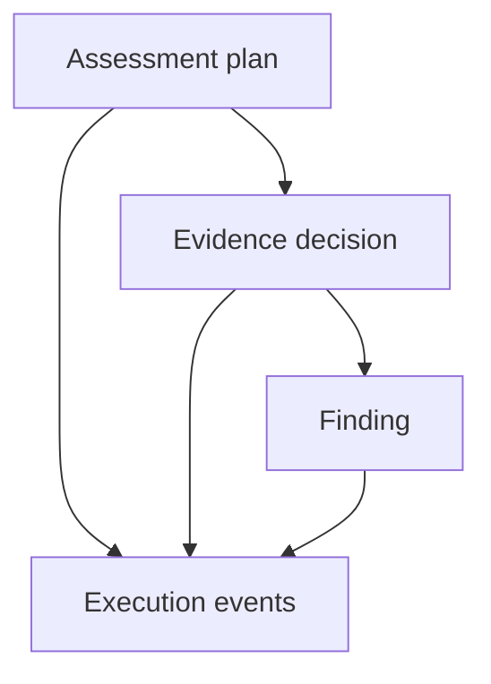

# Phase 1 — Define the Assessment Contracts

## Objective

Define the vocabulary and machine-validatable data structures used between
future assessment components. Phase 1 answers:

> What information may components exchange, and what makes that information
> structurally valid?

## Why contracts came before agents

If components exchange loosely structured dictionaries, terms such as
“approved,” “complete,” or “reviewed” can acquire inconsistent meanings.
Phase 1 establishes closed vocabularies and JSON Schemas before orchestration is
introduced.

## What Phase 1 added

Four versioned contracts:

| Contract | Purpose |
|---|---|
| `assessment_plan` | Identifies the assessment, scope and review disposition |
| `evidence_decision` | Records deterministic checks, evidence references, confidence and escalation |
| `finding` | Records condition, criteria, risk, recommendation and human disposition |
| `execution_event` | Records workflow activity, policy decision, status, errors and provenance |

The controlled vocabulary includes:

- evidence decisions such as `EVIDENCED`, `PARTIALLY_EVIDENCED`, and
  `NOT_EVIDENCED`;
- human dispositions `PENDING`, `ACCEPTED`, `MODIFIED`, and `REJECTED`;
- workflow and execution-event states;
- preliminary finding severities.

## Contract flow

Every contract requires provenance. Unknown properties and unsupported
enumeration values are rejected.

## Main deliverables

- `agentic_assessment/schemas/assessment_plan.schema.json`
- `agentic_assessment/schemas/evidence_decision.schema.json`
- `agentic_assessment/schemas/finding.schema.json`
- `agentic_assessment/schemas/execution_event.schema.json`
- `docs/implementation/phase_1_controlled_vocabulary.md`
- Valid and intentionally invalid fixtures under
  `tests/fixtures/agentic_assessment/`.

## Validation result

- Contract-specific tests: **12 passed** at Phase 1 completion.
- Complete regression suite: **85 passed**.
- Valid fixtures were accepted.
- Invalid enumerations and contradictory records were rejected.
- The frozen Clause 04 engine remained unchanged.

## Why this phase matters

The schemas create an audit boundary. A later component cannot silently invent
a new disposition, omit provenance, or represent a pending finding as accepted
without failing validation.

## Portfolio value

Phase 1 demonstrates disciplined evidence modeling: conclusions, findings,
human judgments, and execution history have explicit and testable structures.

## Accepted limitations

Phase 1 validates structure, not truth. A schema-valid evidence decision may
still rely on incomplete or incorrect source information. No supervisor,
finding generator, policy enforcer, or model was introduced in this phase.

## Exit criteria

Phase 1 is complete when all four contracts validate, negative fixtures fail as
expected, controlled terms are stable, and the baseline continues to pass.

## Next phase

Phase 2 establishes who is allowed to create or act on these records.
