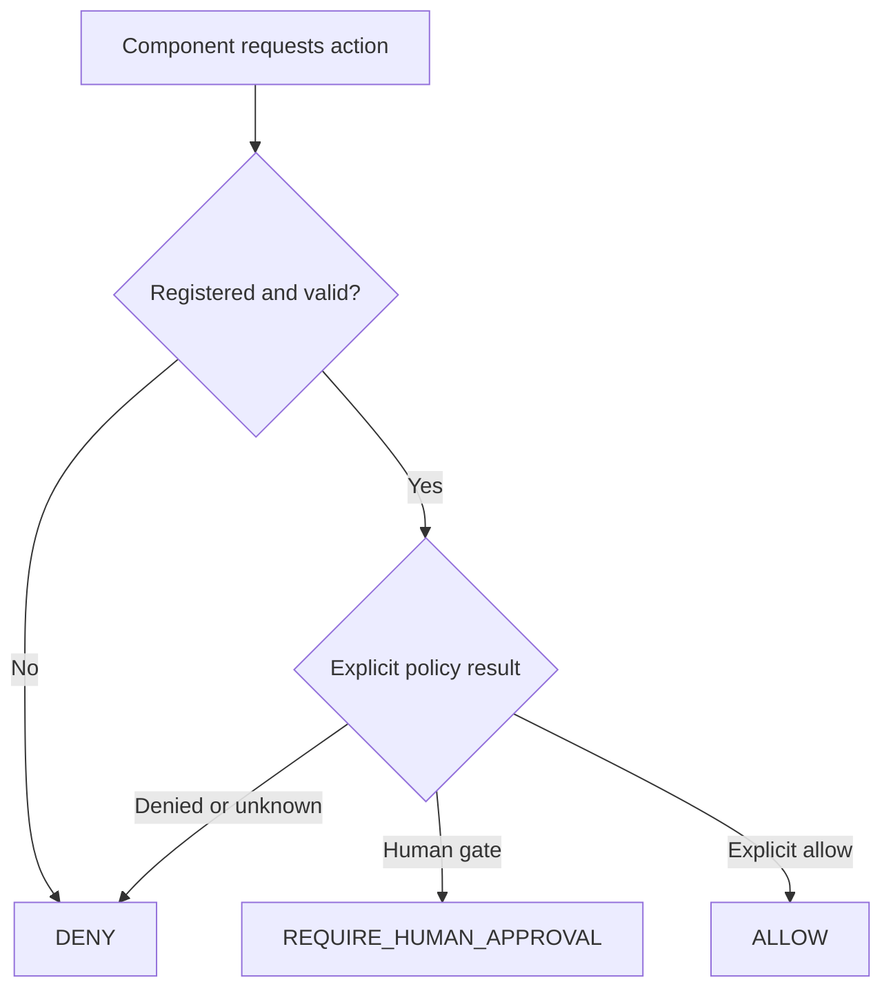

# Phase 2 — Enforce Governance Before Orchestration

## Objective

Create a deterministic control layer before allowing a supervisor or specialist
component to act. Phase 2 answers:

> Which component may perform which action, and what happens when the action is
> not explicitly permitted?

## Design principle

The governance layer is fail-closed. An action is denied unless the component,
resource, and action are valid and the action is explicitly allowed.

## What Phase 2 added

| Control | Function |
|---|---|
| Agent registry | Identifies components, execution modes and prohibited capabilities |
| Permission matrix | Defines allowed, denied and human-approval actions |
| Human-approval rules | Defines eligible roles and approval requirements |
| Model-use record | Records that no model is used in the governed path |
| Policy enforcer | Returns `ALLOW`, `DENY`, or `REQUIRE_HUMAN_APPROVAL` |
| Startup validator | Refuses to start when governance invariants are invalid |

## Decision flow

Deny precedence means an explicit denial wins even if malformed configuration
also lists the action as allowed.

## Main deliverables

- `governance/agent_registry.yaml`
- `governance/permission_matrix.yaml`
- `governance/human_approval_rules.yaml`
- `governance/model_use_record.yaml`
- `governance/config_loader.py`
- `governance/policy_enforcer.py`
- `governance/startup_validator.py`
- Governance schemas and positive/negative fixtures.
- `docs/architecture/ADR-0002-deterministic-governance-layer.md`

## Validation result

- Full Phase 2 regression suite: **132 passed**.
- Unregistered components were denied.
- Unknown actions were denied by default.
- External-model calls were denied.
- Invalid governance configuration prevented runtime startup.
- Human-approval actions could not be silently treated as allowed.

## Why this phase matters

Building orchestration first would allow its permissions to become implicit.
Phase 2 establishes the control boundary independently so later orchestration
must conform to declared permissions.

## Portfolio value

Phase 2 demonstrates that governance is executable rather than merely written
in a policy document. Registry, permission, approval, and model-use claims are
validated at startup and tested against negative cases.

## Accepted limitations

Phase 2 created the control layer but not the assessment workflow. File-system
boundaries were documented but not enforced by operating-system controls. The
phase also recorded a registry-to-implementation gap to be resolved before
runtime orchestration.

## Exit criteria

Phase 2 is complete when governance configuration is schema-valid, unsafe or
unknown requests are denied, startup fails on broken invariants, and no model
capability is implicitly enabled.

## Next phase

Phase 3 registers and integrates the sequential supervisor and specialist
assessment components under this governance layer.
