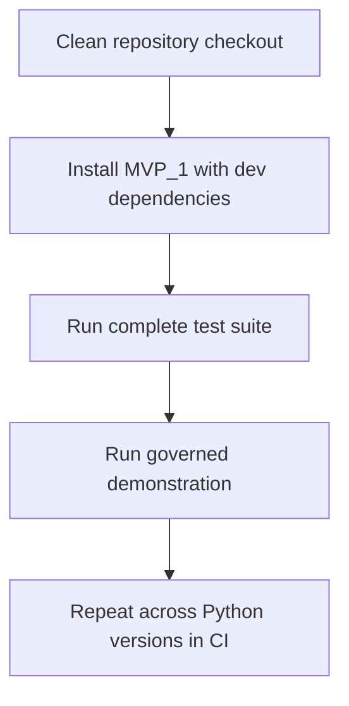

# Phase 3.1 — Make the MVP Reproducible

## Objective

Make the completed Clause 04 workflow installable and independently testable
from a clean repository checkout. Phase 3.1 answers:

> Can another reviewer reproduce the implementation without relying on the
> original developer's machine?

## Problem addressed

At the end of Phase 3, the workflow and tests existed, but the repository did
not provide one authoritative dependency declaration and automated validation
across supported Python versions. Successful execution on one workstation was
therefore weaker evidence than a repeatable clean installation.

## What Phase 3.1 added

- `pyproject.toml` as the package and dependency declaration.
- Python 3.11–3.13 support.
- Bounded `jsonschema`, `PyYAML`, and pytest dependencies.
- Package-data rules for schemas, questions, responses, and governance YAML.
- An explicit executable `scripts` package.
- Clean-clone installation and validation instructions.
- A GitHub Actions matrix for Python 3.11, 3.12, and 3.13.
- Correction of duplicate event-file writing and duplicate console output in
  the demonstration runner.

## Reproducibility flow



## Commands

From the repository root in PowerShell:

```powershell
python -m venv .venv
.\.venv\Scripts\python.exe -m pip install -e ".\MVP_1[dev]"
.\.venv\Scripts\python.exe -m pytest .\MVP_1\tests
.\.venv\Scripts\python.exe -m scripts.run_agentic_clause04_demo
```

## Main deliverables

- `MVP_1/pyproject.toml`
- `.github/workflows/mvp1-tests.yml`
- `MVP_1/README.md`
- `MVP_1/scripts/__init__.py`
- Updated root documentation, version record, and changelog.

## Validation result

- Editable package installation succeeded in a fresh virtual environment.
- Complete regression and the real Clause 04 demonstration passed locally.
- The Phase 3.1 change was merged to `main`.
- GitHub Actions provides the authoritative multi-version validation record.

## Why this phase matters

Reproducibility changes the claim from “the code worked for its author” to
“the method can be independently installed and checked.” This is particularly
important for an assurance-oriented portfolio.

## Portfolio value

Phase 3.1 gives a technical reviewer clear commands to validate the project and
a CI history showing that the same behavior is checked outside the developer's
local environment.

## Accepted limitations

Reproducibility does not prove that the assessment handles adverse or disputed
evidence. The Phase 3 demonstration still represents primarily the successful
path.

## Exit criteria

Phase 3.1 is complete when a clean environment can install the package, run the
full suite, execute the demonstration, and reproduce the same governed outcome
through CI.

## Next phase

Phase 3.2 adds persistent complete, incomplete, and human-reviewed cases.
