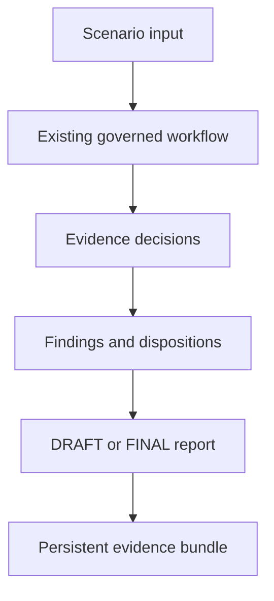

# Phase 3.2 — Prove Complete, Incomplete, and Reviewed Cases

## Objective

Turn the Phase 3 workflow into a set of repeatable demonstration cases rather
than relying on one successful run. Phase 3.2 answers:

> What does the governed workflow do when evidence is complete, incomplete, or
> subject to different human-review decisions?

## Why this phase was needed

The Phase 3 demonstration established that all components could work together.
It did not give a prospect three stable cases to compare. Phase 3.2 adds those
cases and persists the entire decision trail for each one.

## Scenario comparison

| Scenario | Input condition | Findings | Human dispositions | Result |
|---|---|---:|---|---|
| `SCN-01-COMPLETE` | Four structured evidence references | 0 | None required for findings | `FINAL` |
| `SCN-02-INCOMPLETE` | One missing and one partial reference | 2 | Both remain `PENDING` | `DRAFT` |
| `SCN-03-REVIEWED` | Missing, partial, and flagged evidence | 3 | One accepted, one modified, one rejected | `FINAL` |

## How one scenario runs



Phase 3.2 does not implement a second assessment engine. Each scenario is sent
through the existing adapter, evidence assessor, finding generator,
human-review service, report generator, and governed supervisor.

## Persistent artifact bundle

Each scenario writes:

| Artifact | Meaning |
|---|---|
| `scenario_input.json` | Reproducible facts and expected outcome |
| `evidence_decisions.json` | Deterministic classification of each evidence record |
| `findings.json` | Generated findings and final human dispositions |
| `human_review_record.json` | Explicit reviewer-supplied decisions |
| `execution_events.json` | Ordered governed workflow events |
| `acceptance_summary.json` | Comparison-ready result summary |
| `report_DRAFT.md` or `report_FINAL.md` | Human-readable assessment output |

Scenario definitions are in `scenarios/clause04/`. Generated bundles are in
`reports/portfolio/clause04/<scenario-id>/`.

## Determinism

Normal runtime components continue to use the current UTC time. Phase 3.2 adds
optional clock injection so scenario fixtures can use declared fixed timestamps.
This makes successive scenario runs byte-for-byte comparable without changing
production defaults or Clause 04 scoring.

## Commands

From the repository root in PowerShell:

```powershell
.\.venv\Scripts\python.exe -m scripts.run_clause04_portfolio_scenarios
```

Expected console summary:

```text
SCN-01-COMPLETE: COMPLETED / FINAL
SCN-02-INCOMPLETE: COMPLETED / DRAFT
SCN-03-REVIEWED: COMPLETED / FINAL
```

## Main deliverables

- `agentic_assessment/portfolio_scenarios.py`
- `scripts/run_clause04_portfolio_scenarios.py`
- `scenarios/clause04/`
- `reports/portfolio/clause04/`
- `tests/test_portfolio_scenarios.py`
- Optional clock injection in the four timestamp-producing components.

## Validation result

- Complete regression suite: **241 passed**.
- All three scenarios produced their expected workflow and report states.
- Pending findings could not produce a final report.
- Accepted, modified, and rejected dispositions remained traceable.
- Unknown review references and invalid scenario configurations failed closed.
- Repeated runs produced byte-for-byte identical artifacts.

## What `FINAL` means

In the current workflow, `FINAL` means that no generated finding remains in the
`PENDING` disposition. It does not mean that evidence files were independently
verified, that the organization conforms to ISO/IEC 42001, or that a
certification decision was made.

`SCN-01-COMPLETE` has no findings, so no finding-level human disposition is
required. The current MVP does not implement a separate overall assessment
approval gate.

## Portfolio value

Phase 3.2 provides visible proof that the method distinguishes a successful
case from an incomplete one and preserves human disagreement. During a
portfolio walkthrough, the incomplete report and reviewed decision record are
more informative than the console status alone.

## Accepted limitations

- The cases are generic Clause 04 fixtures, not yet a named AI SaaS case study.
- Evidence references are recorded, not checked for file existence or hash.
- Evidence content is not interpreted or accepted automatically.
- Reviewer authentication remains external to the MVP.
- There is no overall assessment-approval gate beyond finding disposition.

## Exit criteria

Phase 3.2 is complete when the three scenarios run through the existing
governed workflow, produce all required artifacts, enforce draft status for
pending findings, preserve explicit human dispositions, and remain
deterministic across repeated runs.

## Next step

Add a short synthetic AI-enabled SaaS case narrative that explains the three
scenarios in buyer language. Evidence existence, integrity, provenance, and
content-review states belong to the later evidence-verification phase.
