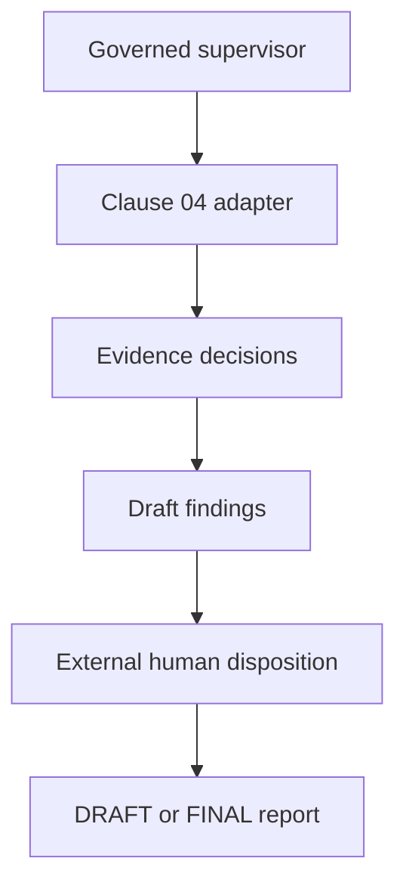

# Phase 3 — Integrate the Governed Clause 04 Workflow

## Objective

Connect the frozen Clause 04 engine, governance layer, specialist components,
human-review boundary, and report generation into one end-to-end assessment.
Phase 3 answers:

> Can the system complete a Clause 04 assessment while preserving decision
> ownership, provenance, and human accountability?

## What Phase 3 added

| Component | Responsibility |
|---|---|
| `SequentialSupervisor` | Coordinates the declared workflow and emits execution events |
| `Clause04Adapter` | Invokes and normalizes the frozen deterministic result |
| `EvidenceAssessor` | Converts evidence records into controlled evidence decisions |
| `FindingGenerator` | Creates deterministic draft findings where evidence is insufficient |
| `HumanReviewService` | Applies externally supplied human dispositions |
| `ReportGenerator` | Produces a governed `DRAFT` or `FINAL` report |
| `Clause04Workflow` | Binds the components to supervisor steps |

## End-to-end flow

The full sequence contains seven declared stages: planning, question selection,
Clause 04 execution, evidence assessment, finding generation, human-review
decision, and report generation.

## Key decision boundaries

- The original engine remains the sole readiness-scoring authority.
- The adapter normalizes results but does not rescore them.
- The evidence assessor uses deterministic rules and does not interpret file
  contents.
- The finding generator creates only draft findings.
- The human-review service cannot invent a reviewer or disposition.
- A report remains `DRAFT` while any finding is `PENDING`.
- `FINAL` means no finding remains pending; it is not certification.

## Main deliverables

- `agentic_assessment/supervisor.py`
- `agentic_assessment/clause04_adapter.py`
- `agentic_assessment/evidence_assessor.py`
- `agentic_assessment/finding_generator.py`
- `agentic_assessment/human_review.py`
- `agentic_assessment/report_generator.py`
- `agentic_assessment/clause04_workflow.py`
- `scripts/run_agentic_clause04_demo.py`
- Persistent acceptance evidence under `reports/evidence/agentic_clause04/`.

## Validation result

- Full Phase 3 regression suite: **232 passed**.
- Focused end-to-end suite: **9 passed**.
- All seven workflow stages completed.
- Sixteen execution events were recorded.
- The original **100.0%** readiness result was preserved.
- Invalid review references and dispositions stopped safely.

## Why this phase matters

Earlier phases established data and authority. Phase 3 proves they work
together: a prospect can trace an assessment identifier through evidence
decisions, findings, human review, events, and the final report.

## Portfolio value

Phase 3 demonstrates a technically governed review method rather than a simple
checklist or free-form AI answer. It makes the separation between automated
processing and accountable human judgment visible.

## Accepted limitations

The original Phase 3 demonstration is a successful, complete-evidence path. It
does not by itself show missing evidence, pending findings, or different human
dispositions as reusable portfolio cases. Evidence files and their contents
are still not independently verified.

## Exit criteria

Phase 3 is complete when all components run through the supervisor, contracts
remain valid, failures stop safely, human approval is not fabricated, and the
report preserves the deterministic score.

## Next phase

Phase 3.1 makes this implementation reproducible for an external reviewer.
